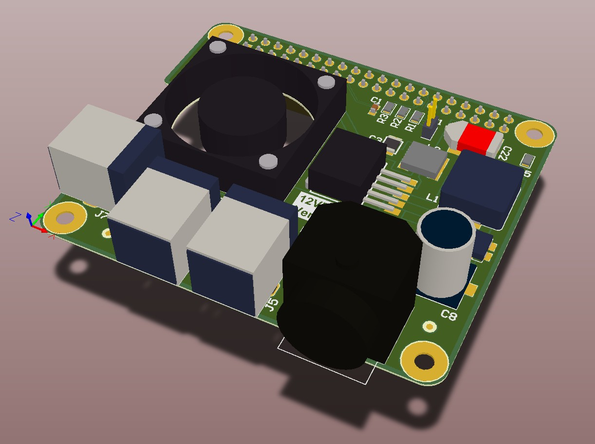

12V PowerHAT.
============

:Stable release:  Released.

:Status:  Intila.

:Maintainer:  sjames@hydrasystems.com

:Description:  Rock Pi 4c+ 12V PSU & Switched Power Output.

Key Features
============

    * Provides 5V at 3A:
    * 9V-36V input tolerent.
    * 1 x static supply output.
    * 2 x switched supply outputs.
    * Cooling fan.
    * Includes ROM for complience.

To Do
=====

Known Issues
============

Required Repositories
================

* None

Required Hardware
=================

* Rock Pi 4.

Note
=======

Support
=======

Problems can be reported using the issues tab in github.
